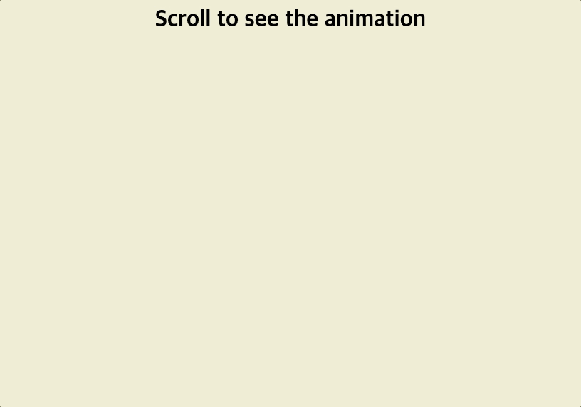

# Scroll Animation



## 배운점

#### 스크립트

```javascript
const boxes = document.querySelectorAll(".box");

window.addEventListener("scroll", checkBoxes);

let example = [];

function checkBoxes() {
  const triggerBottom = (window.innerHeight / 5) * 4;

  boxes.forEach((box) => {
    const boxTop = box.getBoundingClientRect().top;

    if (boxTop < triggerBottom) {
      box.classList.add("show");
    } else {
      box.classList.remove("show");
    }
  });
}
```

- window.innerHeight는 뷰포트에서 창틀을 뺀 내용과 스크롤을 포함한 크기임
- window.innerHeight를 활용하여 화면에서 특정 높이의 기준을 잡아 만약에 이보다 작을 시 .show classList를 추가하는 방식으로 작동
- getBoundClientRect() 사용시 해당 엘리먼트가 뷰포트 내의 위치정보를 구할 수 있음
