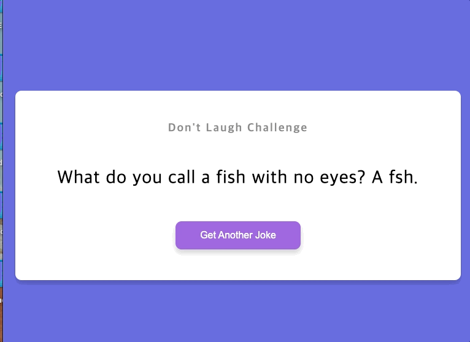

# 제목



## 배운점

#### 스크립트

```javascript
// async/await
async function generateJoke() {
  const config = {
    headers: {
      Accept: "application/json",
    },
  };

  const res = await fetch("https://icanhazdadjoke.com", config);
  const data = await res.json();

  jokeEl.innerHTML = data.joke;
}
```

- 자바스크립트에서는 fetch를 통해 외부의 api 데이터를 쉽게 얻을 수 있음
- 그냥 받으면 해당 웹의 html 등 불필요한 데이터도 같이 불러오기에 option을 통해 헤더에 어떤 데이터를 받을지 설정했음
