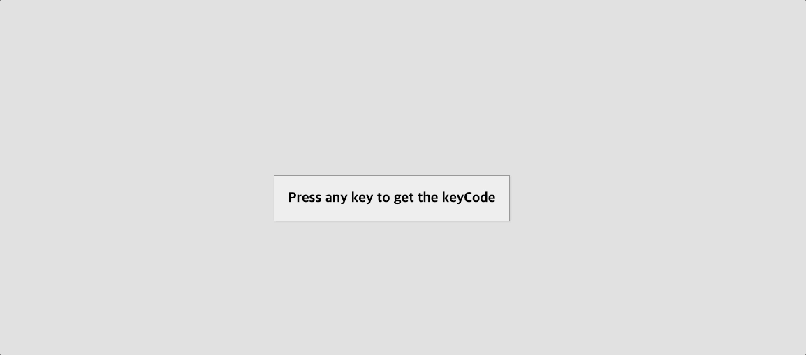

# 제목



## 배운점

#### 스크립트

```javascript
window.addEventListener("keydown", (e) => {
  insert.innerHTML = `
    <div class="key">
      ${e.key === " " ? "Space" : e.key}
      <small>event.key</small>
    </div>
    <div class="key">
      ${e.keyCode}
      <small>event.keyCode</small>
    </div>
    <div class="key">
      ${e.code}
      <small>event.code</small>
    </div>
  `;
});
```

- keydown 이벤트를 통해 해당 키보드의 코드를 알 수 있음
- keyCode는 deprecated 됐음
