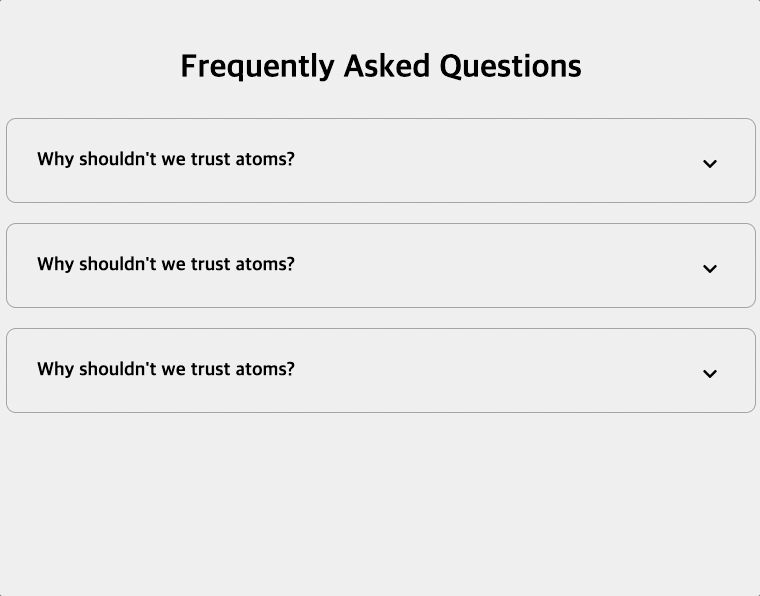

# FAQ Collapse



## 배운점

#### 스크립트

```javascript
const toggles = document.querySelectorAll('.faq-toggle');

toggles.forEach(toggle => {
  toggle.addEventListener('click', () => {
    console.log(toggle.parentNode)
    /*
      <div class="faq">
        <h3 class="faq-title">Why shouldn't we trust atoms?</h3>
        <p class="faq-text">They make up everything</p>
        <button class="faq-toggle">...</button>
      </div>
    */
    console.log(toggle.parentNode.classList)
    /*
      DOMTokenList(2) ['faq', 'active', value: 'faq active']
        0: "faq"
        length: 1
        value: "faq"
        [[Prototype]]: DOMTokenList
    */
    toggle.parentNode.classList.toggle('active');
  })
})
```

- querySelectorAll과 forEach()를 통해 모든 .faq-toggle 클래스를 지닌 버튼에 addEventListener를 주도록 함
- 해당 노드의 parentNode의 클래스에 접근하여 active를 toggle할 수 있도록 함
