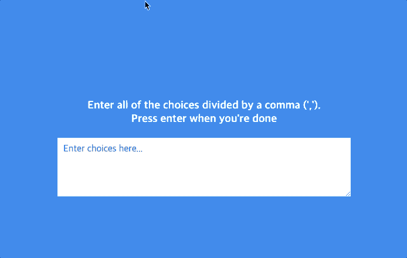

# Select Random Tag

## 배운점

#### 스크립트

- setTimeout 함수는 두번 째 인수로 전달받은 시간(ms, 1/1000 초)으로 단 한번 동작하는 타이머를 생성함. 타이머가 만료되면 첫번째 인수로 전달받은 콜백 함수가 호출됨
- setInterval 함수는 전달받은 시간이 경과할 때마다 첫번째 인수로 전달받은 콜백 함수를 실행되도록 호출 스케줄링함.
