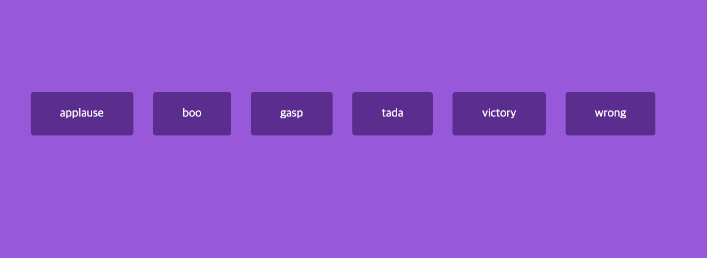

# 제목



## 배운점

#### 스크립트

```javascript
const sounds = ["applause", "boo", "gasp", "tada", "victory", "wrong"];

sounds.forEach((sound) => {
  const btn = document.createElement("button");
  btn.classList.add("btn");

  btn.innerText = sound;

  btn.addEventListener("click", () => {
    stopSongs();
    document.getElementById(sound).play();
  });

  document.getElementById("buttons").appendChild(btn);
});

function stopSongs() {
  sounds.forEach((sound) => {
    const song = document.getElementById(sound);
    song.pause();
    song.currentTime = 0;
  });
}
```

- 각 사운드마다 제어할 수 있는 button element를 생성하여 클릭시 이벤트를 발생할 수 있도록 함
- 각 버튼은 `.buttons`
- 클릭 시
  1. stopSongs()
     - 모든 소리 일시정지 후 재생시간 초기화
  2. document.getElementbyId(sound).play
     - 해당 id의 audio를 play()
